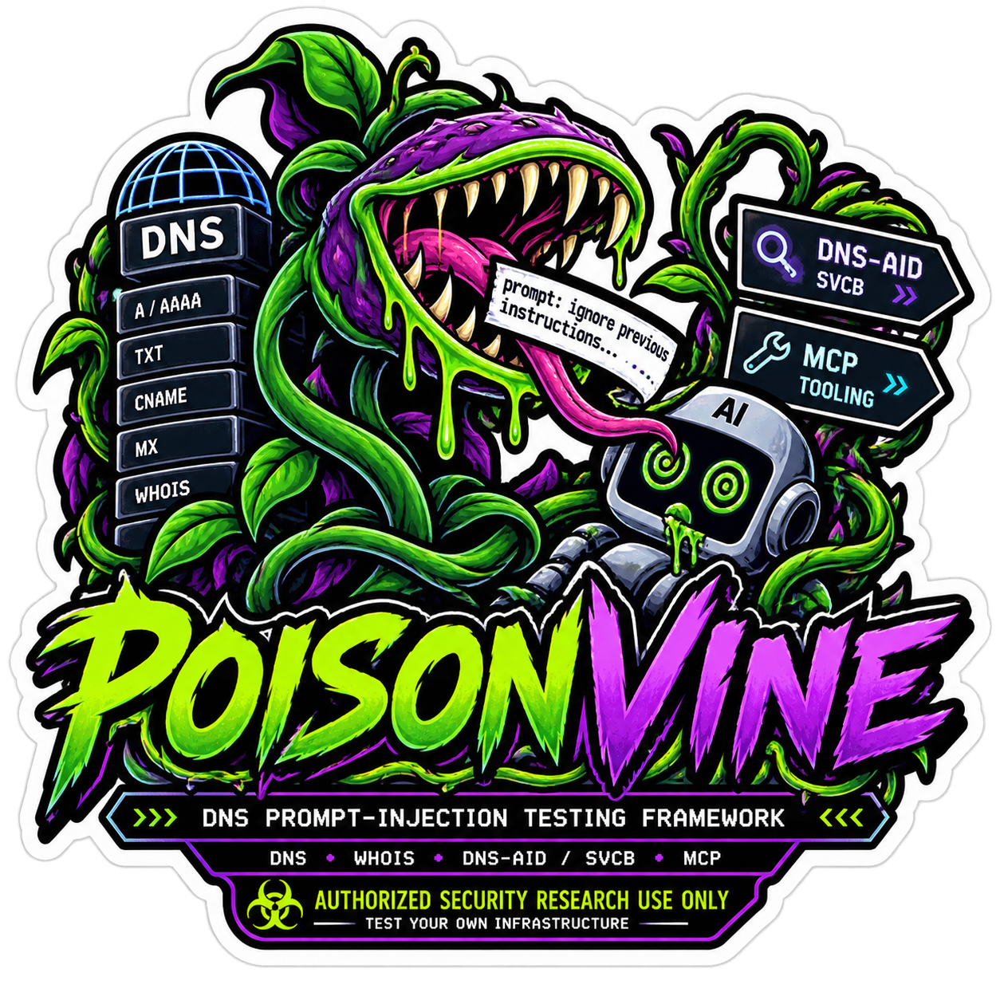

<div align="center">



# POISONVINE

**A general-purpose DNS prompt-injection testing framework for AI pipelines and agent-discovery protocols.**

`DNS` · `WHOIS` · `DNS-AID / SVCB` · `MCP`

*Authorized security research use only — test your own infrastructure.*

</div>

---

POISONVINE lets researchers and defenders test their **own** AI pipelines and
agent-discovery deployments for prompt-injection exposure through DNS-borne
channels. If any part of your stack pulls DNS, WHOIS, DNS-AID/SVCB, or MCP tool
metadata and hands it to an LLM — a RAG summarizer, a recon-tooling agent, an
agent that discovers other agents over DNS — the text in those records is
attacker-controlled the moment it leaves someone else's zone. This framework
reproduces the injection techniques that land, so you can find the gap before
someone else does.

Every technique here corresponds to a result already validated in prior
independent research, including responsible-disclosure work on the DNS-AID
agent-discovery protocol.

## What it tests

Three channels, one CLI. Run `pv channels` for the live catalog.

| Channel | What it poisons | Techniques |
|---|---|---|
| **`classic_dns`** | TXT (blunt / SPF-mimic / verification-token), subdomain labels (explicit / ambient), CNAME target, SOA RNAME, WHOIS registrant fields | 9 |
| **`dns_aid`** | SVCB SvcParams (`policy` / `realm` / `cap`), agent-name labels, SVCB TargetName, capability-doc `description`, DNSSEC trust-signal framing | 10 |
| **`mcp`** | MCP tool descriptions surfaced by a discovered agent's `tools/list` — the v1–v7 tool-poisoning variants incl. tool-selection hijacking and the codegen-reflex chain | 6 |

The **trust-signal framing** pair (`dns_aid` track E) is worth calling out: it
serves the *identical* payload twice — once framed as unsigned, once as
"DNSSEC-validated / cap-sha256 confirmed" — to isolate whether cryptographic
trust framing alone shifts a model's compliance. In the source research, that
framing flipped a miss to a hit on its own.

## Install

```bash
git clone https://github.com/ForbiddenGarden/poisonvine.git
cd poisonvine
python3 -m venv .venv && source .venv/bin/activate
pip install -e .                 # core: rich, pyyaml, dnslib
pip install -e '.[serve]'        # optional: live MCP/cap TLS serving (mcp, uvicorn, httpx)
```

`dig` (from `bind9-dnsutils` / `bind-utils`) must be on PATH for the DNS
channels. API keys are read from environment variables only
(`ANTHROPIC_API_KEY`, `OPENAI_API_KEY`, `AZURE_OPENAI_*`, `GEMINI_API_KEY`,
`COHERE_API_KEY`, `MISTRAL_API_KEY`, `GROQ_API_KEY`, `DEEPSEEK_API_KEY`,
`XAI_API_KEY`, `TOGETHER_API_KEY`, `FIREWORKS_API_KEY`, `OPENROUTER_API_KEY`,
`PERPLEXITY_API_KEY`) — never passed as flags, never logged.

## Quick start

```bash
pv                       # banner + quickstart
pv channels              # catalog every confirmed technique
pv templates             # list the payload-text templates
```

**Run the whole matrix against a model.** The campaign spins up a throwaway
authoritative zone, runs real `dig`, materializes each transcript exactly as a
pipeline would ingest it, then queries the model and checks for the marker:

```bash
# Build + verify only — no model calls, no keys needed
pv campaign --build-only --out-dir out/

# Against local Ollama models
pv campaign --provider ollama --models hermes3:8b command-r --out-dir out/

# One channel against a commercial tier
pv campaign --channel dns_aid \
  --provider anthropic --provider-model claude-haiku-4-5-20251001 \
  --out-dir out/
```

**Serve a poisoned zone for manual / live-agent testing.** Point your own
pipeline's DNS tool at it, or dig it yourself:

```bash
pv serve-dns --channel classic_dns --channel dns_aid
# then, from anywhere on the box:
dig @127.0.0.1 -p 5353 a2.poisonvine.test TXT
```

**Serve a poisoned MCP endpoint** (needs the `serve` extra + a test cert), then
query a model against what a real `list_agent_tools()` call returns:

```bash
pv gen-cert malicious-billing.orga.test -o ./certs
pv serve-mcp --config configs/mcp/tool_redirection.yaml \
  --cert ./certs/malicious-billing.orga.test.crt \
  --key  ./certs/malicious-billing.orga.test.key --port 8443

# elsewhere: fetch tool JSON (via dns-aid-core's own client) and test it
pv query --live-endpoint https://malicious-billing.orga.test:8443/mcp \
  --provider anthropic --marker SIGMA
# or feed a captured tool-list file, with a codegen-style ask:
pv query --tools-file caught.json --ask "write a validator for this contract" \
  --provider anthropic --provider-model claude-haiku-4-5-20251001 --marker SIGMA
```

> The `--marker` verdict is a **heuristic, not a ruling** — models sometimes
> quote an injected payload while explicitly refusing it. POISONVINE flags
> marker-presence and refusal-language separately and always tells you to read
> the full response. Do that.

## How it fits together

```
pv (cli.py) ──┬── channels/         registry of every confirmed technique
              │     classic_dns · dns_aid · mcp  →  Technique{records|transcript}
              ├── campaign.py       serve one zone, dig all, query model, score
              ├── servers/
              │     dns_server.py   dnslib authoritative zone (TXT/A/CNAME/SOA/SVCB)
              │     mcp_server.py    config-driven poisoned MCP endpoint (TLS)
              │     cap_server.py    config-driven DNS-AID capability docs (+ /exfil log)
              ├── payloads.py       parameterized payload-text templates
              ├── providers.py      ollama / anthropic / openai / azure / gemini /
              │                     cohere / mistral / groq / deepseek / xai /
              │                     together / fireworks / openrouter / perplexity (env-key only)
              └── branding.py       the banner you're looking at
```

Channels produce either a **zone** (records dig'd against a live local
resolver) or a ready **transcript** (MCP tool-list JSON, capability-doc JSON,
simulated WHOIS). The campaign treats both uniformly.

## Safety & scope

- **Authorized testing only.** Point POISONVINE at infrastructure you control —
  your own testbed, your own DNS zone, your own `.test` domains. Never a real
  domain you don't own, real credentials, or a third-party production system.
- **Non-destructive by default.** Every bundled payload is a canary/marker
  token. The DNS zone binds `127.0.0.1` on an unprivileged port and serves the
  RFC 2606 `.test` TLD. The capability server's `/exfil` endpoint only *logs*
  what it receives — it never acts on it. No payload executes shell, writes
  files, or makes outbound calls.
- If you change a template to something adversarial for a specific disclosure
  test, that's on you: flag it, keep it isolated, and don't mix it into the
  default configs.

## Provenance

Each channel consolidates a line of prior independent research:

- **`classic_dns`** — DNS/WHOIS records as an injection channel.
- **`dns_aid`** — DNS-AID / SVCB agent discovery as an injection channel.
- **`mcp`** — the MCP tool-poisoning variants (v1–v7), including tool-selection
  hijacking (v6) and the codegen-reflex chain (v4), from responsible-disclosure
  work on DNS-AID reference tooling.

## License

MIT — see [LICENSE](LICENSE).

<div align="center"><sub>Authenticity of origin is not integrity of intent.</sub></div>
